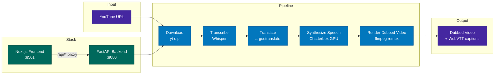

# Foreign Whispers

[](./LICENSE)

YouTube video dubbing pipeline — transcribe, translate, and dub 60 Minutes interviews into a target language.

---

## Student Submission Notes

### Team Information

1. Laxman Singh Rawat (lr3531@nyu.edu)
2. Harindham Sharma (hs6169@nyu.edu)

### Notebook Integration Work

Each integration notebook introduced one stage of the pipeline. Below is a summary of the implementation approach taken per notebook and the reasoning behind it.

---

#### Notebook 1 — Download Integration *(no coding)*

Explored the `yt-dlp`-backed download stage via the `FWClient.download()` SDK method. The notebook establishes the `{start, end, text}` segment-dict format that every downstream stage consumes. Artifacts land in `pipeline_data/api/videos/` (MP4) and `pipeline_data/api/youtube_captions/` (JSON).

---

#### Notebook 2 — Transcription Integration *(no coding)*

Compared two transcription sources:

| Mode | Approach | Pros | Cons |
|------|----------|------|------|
| `use_youtube_captions=True` | Parses auto-generated captions from yt-dlp | Fast, no GPU | Coarser timing, inconsistent quality |
| `use_youtube_captions=False` | Runs Whisper STT on the audio track | Accurate timestamps, uniform quality | Requires GPU, slower |

**Decision:** Whisper was chosen for the final pipeline. YouTube captions for the Hormuz video produced 170 short, fragmented segments with uneven timing. Whisper produced 98 cleaner segments with acoustically-grounded boundaries, which gave the alignment stage a more reliable source window to work with.

---

#### Notebook 3 — Translation Integration

**Task: Duration-aware re-ranking (`get_shorter_translations`)**

The argostranslate offline translator has no duration budget — it expands Spanish text by ~10–30% over English on average. When a translated segment is too long to synthesise within the source window, a shorter alternative is needed.

**Approach:** A three-stage hybrid in `foreign_whispers/reranking.py`:

1. **Learned cache** — memoises previously shortened segments to avoid re-generating on repeat runs.
2. **Rule-based contractions** — applies a hand-curated shortening dictionary for common Spanish phrases (e.g. "horas extra" → "extras"). Zero network dependency.
3. **OpenRouter LLM fallback** — calls an LLM via `OPENROUTER_API_KEY` when rules don't produce a candidate short enough. Falls back gracefully when the key is absent.

The hybrid is conservative: it only invokes the more expensive stage when the cheaper one fails to find a fitting candidate.

---

#### Notebook 4 — Diarization Integration *(5 tasks)*

**Task 1: `assign_speakers` merge function**

Implemented in `foreign_whispers/diarization.py`. For each Whisper segment, finds the pyannote diarization interval with the greatest temporal overlap (`max(0, min(seg_end, diar_end) - max(seg_start, diar_start))`) and copies its speaker label. Defaults to `SPEAKER_00` when diarization is empty — keeping the function backwards-compatible with non-diarized runs. All 4 TDD unit tests pass.

**Task 2: `POST /api/diarize/{video_id}` endpoint**

Created `api/src/routers/diarize.py` and `api/src/schemas/diarize.py`. The endpoint extracts a 16 kHz mono WAV via ffmpeg, runs pyannote, caches the result as JSON, and returns a `DiarizeResponse`. A cache check at the top of the handler means subsequent calls skip pyannote entirely and return `skipped: true`.

**Task 3: Merge speaker labels into transcription**

After diarization, `_merge_labels_into_transcript` in the diarize router writes speaker fields into both `transcriptions/{title}.json` and `translations/{title}.json`. Merging into the translation JSON is essential — the TTS engine reads from the translation file, so without this fix per-speaker voice selection silently fell back to the default voice on every segment.

**Task 4: Frontend pipeline integration**

Added a `diarize` stage to the frontend between Transcribe and Translate in `frontend/src/hooks/use-pipeline.ts` and `frontend/src/components/pipeline-table.tsx`. The stage is conditional — it only runs when diarization is enabled in settings, so the pipeline remains functional without a HuggingFace token.

**Task 5: Per-speaker TTS voice selection**

`_build_speaker_voice_map` in `tts_engine.py` resolves one reference WAV per distinct speaker using a **round-robin with fallback** strategy (implemented in `foreign_whispers/voice_resolution.py`):

1. Non-default WAVs in `speakers/{lang}/` are sorted alphabetically; the speaker index (extracted from the label, e.g. `SPEAKER_02` → 2) selects a file via modulo — so `N` speakers share `K` voice files without manual naming.
2. Falls back to `speakers/{lang}/default.wav`, then `speakers/default.wav`.

Round-robin was chosen over explicit name mapping because it requires no per-speaker configuration — dropping additional WAV files into the language directory automatically distributes them across speakers.

A concurrency race was also fixed: `ThreadPoolExecutor` workers uploading different voice references simultaneously caused cross-speaker voice bleed. The fix sorts segment submissions by resolved voice key before entering the pool so same-voice segments are always batched together.

---

#### Notebook 5 — Alignment Integration *(4 tasks)*

**Task 1: Improve TTS duration prediction**

The baseline heuristic (`syllables / 4.5 ≈ 15 chars/sec`) ignores character density and word boundaries. Ground-truth durations were collected from `.align.json` sidecars produced by prior TTS runs.

**Approach:** Closed-form linear regression on three text features — character count, syllable count, and word count — fitted on the 38-segment Hormuz training corpus. Coefficients are baked into `alignment.py` as constants (`_DUR_COEF_CHARS`, `_DUR_COEF_SYLL`, `_DUR_COEF_WORDS`, `_DUR_BIAS`), so there is no model file to load and no runtime overhead. MAE dropped from **0.608 s → 0.186 s (−69%)**.

**Task 2: Duration-aware translation re-ranking**

Wired `get_shorter_translations()` (already implemented in Notebook 3) into the alignment loop. For each `REQUEST_SHORTER` segment the function is called, the shortest candidate within the ~15 chars/s budget is selected, substituted into a copy of the translation, and metrics are recomputed. The action-distribution before/after comparison confirmed that re-ranking moves over-budget segments into `MILD_STRETCH` or `ACCEPT`.

**Task 3: Beat the greedy optimizer (`global_align_dp`)**

The greedy `global_align` scheduler makes locally optimal decisions and cannot look ahead. Implemented `global_align_dp` in `alignment.py` — a forward DP over the state `(segment_index, cumulative_drift_quantum)` with cost = `overflow + severe_stretch_indicator + drift²`.

**Why DP is strictly better:** the drift² term penalises carrying gap debt forward, so the optimiser learns to skip a gap-shift when the local overflow penalty is cheaper than propagating drift through the rest of the timeline. Every action greedy considers is also a DP candidate, making DP provably ≤ greedy cost. Drift is quantised to 0.1 s to keep state size manageable.

**Task 4: Multi-dimensional dubbing quality scorecard**

`dubbing_scorecard()` in `foreign_whispers/evaluation.py` returns sub-scores in [0, 1] across four dimensions:

| Dimension | Method |
|-----------|--------|
| Timing | Penalises severe stretches and cumulative drift (not raw duration error) |
| Naturalness | Speaking-rate variance across segments |
| Intelligibility | Word error rate of a Whisper STT round-trip on the synthesised audio |
| Semantic fidelity | Cosine similarity of `all-MiniLM-L6-v2` embeddings of source English vs back-translated English |

Heavy services (Whisper, back-translator, embedder) are injected as `typing.Protocol` interfaces so unit tests can mock them without loading model weights.

---

#### Notebook 6 — TTS Integration *(4 tasks)*

**Task 1: Understand the existing Chatterbox client** *(no coding)*

Explored `ChatterboxClient` in `tts_engine.py`. The client routes requests to `/v1/audio/speech` (default voice) or `/v1/audio/speech/upload` (voice cloning with a reference WAV). Baseline vs aligned modes were compared by measuring total WAV duration — aligned mode time-stretches each segment via `pyrubberband` to match the source window.

**Task 2: `resolve_speaker_wav` voice resolution function**

Implemented in `foreign_whispers/voice_resolution.py`. Returns a path relative to `pipeline_data/speakers/` so the Chatterbox container can resolve it via its `/app/voices/` mount. All 5 TDD unit tests pass.

**Task 3: Add `speaker_wav` to the TTS API**

Added `speaker_wav: str | None` as a query parameter to `POST /api/tts/{video_id}`. Forwarded through `tts_service.py` → `tts_engine.py`. When present, it overrides the `None`-keyed entry in the voice map (used for un-diarized segments), keeping backwards compatibility with non-diarized runs.

**Task 4: Per-speaker voice assignment verified end-to-end**

After diarization runs and speaker labels are merged into the translation JSON, `_build_speaker_voice_map` automatically assigns a distinct reference WAV to each speaker. Verified with the Hormuz video: two speakers (`SPEAKER_00`, `SPEAKER_01`) were detected and mapped to separate voice files from `pipeline_data/speakers/es/`.

A voice warmup step (`FW_TTS_WARMUP=on`, enabled by default) synthesises one short phrase per distinct speaker voice before the main synthesis loop and uses the output as the cloning reference for all segments of that speaker. This eliminates inter-segment voice drift caused by Chatterbox's stochastic sampling.

---

#### Notebook 7 — Stitch Integration *(no coding)*

The stitch stage performs audio-only ffmpeg remux: the original video stream is copied as-is (`-c:v copy`), and only the audio track is replaced with the synthesised TTS output. Rolling two-line VTT captions are generated alongside the video — the current translated segment appears on top and the previous segment below, providing continuity for the viewer. No video re-encoding means zero quality loss on the video track.

---

### Challenges

#### 1. Missing Spanish reference voice files

The `pipeline_data/speakers/es/` directory was empty on first run, causing Chatterbox to fall back to its built-in voice for every segment — eliminating the naturalness benefit of voice cloning. We researched OpenSLR (a public corpus of multilingual speech recordings) and downloaded four Spanish reference WAVs (`clf_` female and `clm_` male prefixes) that matched the expected audio format and quality for Chatterbox's voice cloning endpoint.

#### 2. CPU → GPU migration mid-project

Initial development was done on a Mac, which required updating the Docker setup to run the STT and TTS engines in CPU-only mode. CPU Chatterbox synthesis ran at **1–2 it/s**, making a full pipeline run for a 6-minute video take approximately 75 minutes. When TTS throughput became a bottleneck, the setup was migrated to a gaming laptop with an NVIDIA GPU, which brought synthesis throughput up to **6–8 it/s** and reduced full-video pipeline time to approximately 10 minutes. Both `cpu` and `nvidia` Docker Compose profiles were maintained throughout so either environment could be used.

---

### Results

#### Output videos

Dubbed videos and translated captions for all four input videos from the registry are available on Google Drive:

- **Dubbed Videos:** `https://drive.google.com/drive/folders/198QkExc3AztUaDazo8ux88XSUjMHKeXD?usp=sharing`
- **Translated Captions (VTT):** `https://drive.google.com/drive/folders/1tkEq0ABqZYMXveAiyPVZRiQxJ0wwwm_f?usp=sharing`

#### Conclusion

All four videos in `video_registry.yml` were successfully dubbed into Spanish. The configuration that produced the best results was:

| Stage | Choice | Why |
|-------|--------|-----|
| Transcription | **Whisper STT** (not YouTube captions) | More accurate acoustic timestamps; YouTube captions were fragmented and had coarser timing |
| Speaker identification | **Diarization** (pyannote) + per-speaker voice assignment | Distinct voices per speaker make multi-speaker interviews sound natural |
| TTS timing | **Aligned** mode | Each synthesised segment is time-stretched only when necessary, keeping the audio in sync with the video |
| Video assembly | **Original stitch code** (ffmpeg audio remux) | No re-encoding preserves video quality; rolling VTT captions provide translated subtitles |

This combination produced translated videos where speaker voices are natural and audio segments are only stretched when they genuinely exceed the source window. This avoids the "whale sound" distortion that occurred in earlier runs, where shorter audio clips were stretched aggressively based on a crude character-count heuristic regardless of how well they already fit the timing budget.

---

## Architecture



## Quick Start

Two profiles are available via Docker Compose:

```bash
# NVIDIA GPU — Whisper + Chatterbox on dedicated GPU containers
docker compose --profile nvidia up -d

# CPU only — no GPU containers (STT/TTS must be provided externally)
docker compose --profile cpu up -d
```

Open **http://localhost:8501** in your browser.

## Pipeline Stages

| Stage | What it does | Output |
|-------|-------------|--------|
| **Download** | Fetch video + captions from YouTube via yt-dlp | `videos/`, `youtube_captions/` |
| **Transcribe** | Speech-to-text via Whisper | `transcriptions/whisper/` |
| **Translate** | Source → target language via argostranslate (offline, OpenNMT) | `translations/argos/` |
| **Synthesize Speech** | TTS via Chatterbox (GPU) or Coqui (CPU fallback), time-aligned to original segments | `tts_audio/chatterbox/` |
| **Render Dubbed Video** | Replace audio track via ffmpeg remux (no re-encoding) | `dubbed_videos/` |

Captions are served as WebVTT via the `<track>` element — no subtitle burn-in:

| Endpoint | Source | Output |
|----------|--------|--------|
| `GET /api/captions/{id}/original` | YouTube captions (generated on the fly) | — |
| `GET /api/captions/{id}` | Translated segments + YouTube timing offset | `dubbed_captions/*.vtt` |

## Project Structure

```
foreign-whispers/
├── api/src/                     # FastAPI backend (layered architecture)
│   ├── main.py                  # App factory + lazy model loading
│   ├── core/config.py           # Pydantic settings (FW_ env prefix)
│   ├── routers/                 # Thin route handlers
│   │   ├── download.py          # POST /api/download
│   │   ├── transcribe.py        # POST /api/transcribe/{id}
│   │   ├── translate.py         # POST /api/translate/{id}
│   │   ├── tts.py               # POST /api/tts/{id}
│   │   └── stitch.py            # POST /api/stitch/{id}, GET /api/video/*, /api/captions/*
│   ├── services/                # Business logic (HTTP-agnostic)
│   ├── schemas/                 # Pydantic request/response models
│   └── inference/               # ML model backend abstraction
├── frontend/                    # Next.js + shadcn/ui
│   ├── src/components/          # Pipeline tracker, video player, result panels
│   ├── src/hooks/use-pipeline.ts # State machine for pipeline orchestration
│   └── src/lib/api.ts           # API client
├── download_video.py            # yt-dlp wrapper
├── transcribe.py                # Whisper wrapper
├── translate_en_to_es.py        # argostranslate wrapper
├── tts_es.py                    # Chatterbox client + time-aligned TTS generation
├── translated_output.py         # ffmpeg audio remux + legacy subtitle compositing
├── pipeline_data/               # All intermediate and output files (volume-mounted)
│   └── api/
│       ├── videos/              # Downloaded source MP4s
│       ├── youtube_captions/    # Line-delimited JSON from yt-dlp
│       ├── transcriptions/
│       │   └── whisper/         # Whisper output JSON
│       ├── translations/
│       │   └── argos/           # argostranslate output JSON
│       ├── tts_audio/
│       │   └── chatterbox/       # TTS WAV files per config
│       ├── dubbed_captions/     # Target-language VTT
│       ├── dubbed_videos/       # Final dubbed MP4s per config
│       └── speakers/            # Reference voice clips
├── docker-compose.yml           # Profiles: nvidia, cpu, apple
├── Dockerfile                   # Multi-stage: cpu and gpu targets
└── docs/
    └── dubbing-alignment-design.md  # TTS temporal alignment literature survey + design
```

## API Endpoints

| Method | Endpoint | Description |
|--------|----------|-------------|
| POST | `/api/download` | Download YouTube video + captions |
| POST | `/api/transcribe/{id}` | Whisper speech-to-text |
| POST | `/api/translate/{id}` | Source → target language translation |
| POST | `/api/tts/{id}` | Time-aligned TTS synthesis |
| POST | `/api/stitch/{id}` | Audio remux (ffmpeg -c:v copy) |
| GET | `/api/video/{id}` | Stream dubbed video (range requests) |
| GET | `/api/video/{id}/original` | Stream original video (range requests) |
| GET | `/api/captions/{id}` | Translated WebVTT captions |
| GET | `/api/captions/{id}/original` | Original English WebVTT captions |
| GET | `/api/audio/{id}` | TTS audio (WAV) |
| GET | `/healthz` | Health check |

## Development

### Container architecture

```
Host machine
├── foreign_whispers/      ← bind-mounted into API container
├── api/                   ← bind-mounted into API container
├── pipeline_data/api/     ← bind-mounted into API container
│
└── Docker Compose
    ├── foreign-whispers-stt   (GPU)  :8000  — Whisper inference
    ├── foreign-whispers-tts   (GPU)  :8020  — Chatterbox inference
    ├── foreign-whispers-api   (CPU)  :8080  — FastAPI orchestrator
    └── foreign-whispers-frontend      :8501  — Next.js UI
```

The API container is CPU-only — it delegates all GPU work to the STT and TTS
containers via HTTP. The `foreign_whispers/` library and `api/` source are
**bind-mounted** from the host, so edits on the host are immediately visible
inside the container.

### Editing and debugging the library

1. **Start all services:**

   ```bash
   docker compose --profile nvidia up -d
   ```

2. **Edit any file** in `foreign_whispers/` or `api/` on the host (e.g. in VS Code).

3. **Restart the API container** to pick up changes:

   ```bash
   docker compose --profile nvidia restart api
   ```

   To avoid manual restarts, add `--reload` to the uvicorn command in
   `docker-compose.yml`:

   ```yaml
   command: ["uv", "run", "uvicorn", "api.src.main:app", "--host", "0.0.0.0", "--port", "8080", "--reload"]
   ```

   With `--reload`, uvicorn watches for file changes and restarts automatically.

4. **Test via the SDK** from a notebook or Python REPL on the host:

   ```python
   from foreign_whispers import FWClient
   fw = FWClient()             # connects to http://localhost:8080
   fw.transcribe("GYQ5yGV_-Oc")
   ```

5. **Test the library directly** (no Docker needed for pure-Python alignment work):

   ```python
   from foreign_whispers import global_align, compute_segment_metrics, clip_evaluation_report
   ```

   This is the two-phase workflow:
   - **Phase 1 (SDK):** Call `FWClient` methods to drive the pipeline through Docker (download, transcribe, translate, TTS, stitch). Data lands in `pipeline_data/api/`.
   - **Phase 2 (library):** Import `foreign_whispers` directly to iterate on alignment algorithms using data produced in Phase 1. No GPU or Docker needed.

### Local setup (no Docker)

```bash
uv sync                    # install all dependencies
uv run python -c "from foreign_whispers import FWClient; print('ok')"
```

For Jupyter/VS Code notebooks, register the kernel once:

```bash
uv pip install ipykernel
uv run python -m ipykernel install --user --name foreign-whispers
```

Then select the **foreign-whispers** kernel in VS Code's kernel picker.

### When to rebuild

| Change | Action needed |
|--------|--------------|
| Edit `foreign_whispers/*.py` or `api/**/*.py` | Restart API container (or use `--reload`) |
| Edit `pyproject.toml` / add dependencies | `docker compose --profile nvidia build api && docker compose --profile nvidia up -d api` |
| Edit `frontend/` | Frontend has its own hot-reload; no action needed |
| Edit `docker-compose.yml` | `docker compose --profile nvidia up -d` (re-creates changed services) |

### File ownership

The API container runs as your host UID/GID (set in `.env`), so all files it
creates in `pipeline_data/` are owned by you — not root. If you see permission
errors on existing files, they were created by an older root-mode container:

```bash
sudo chown -R $(id -u):$(id -g) pipeline_data/
```

### Frontend

```bash
cd frontend && pnpm install && pnpm dev
```

### Requirements

- Python 3.11
- ffmpeg (system-wide)
- deno (for yt-dlp YouTube extraction)
- NVIDIA GPU recommended for Whisper + Chatterbox inference
